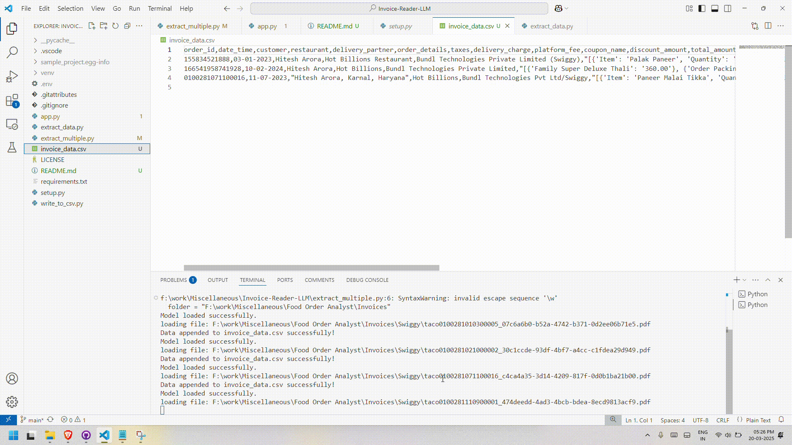

# Invoice Data Extractor

A Streamlit application that extracts data from PDF invoices using LangChain and Mistral AI, and saves it to a CSV file.

## Features

- Upload multiple PDF invoices
- Extract key information using Mistral AI
- Store data in CSV format
- View extracted data in a tabular format
- Easy-to-use web interface

## Prerequisites

- Python 3.8 or higher
- Mistral AI API key

## Installation

1. Clone the repository:
```bash
git clone https://github.com/yourusername/Invoice-Reader-LLM.git
cd Invoice-Reader-LLM
```

2. Install dependencies:
```bash
pip install -r requirements.txt
```

3. Set up environment variables:
Create a `.env` file in the root directory and add your Mistral AI API key:
```
MISTRAL_API_KEY=your_api_key_here
```

## Usage

1. Start the Streamlit app:
```bash
streamlit run app.py
```

2. Open your web browser and navigate to the displayed URL (typically `http://localhost:8501`)

3. Upload PDF invoices using the file uploader

4. View the extracted data in the table below the uploader

## Data Structure

The application extracts the following information from invoices:
- Order ID
- Date and Time
- Customer Name
- Restaurant Name
- Delivery Partner
- Order Details
- Taxes
- Delivery Charge
- Platform Fee
- Coupon Details
- Discount Amount
- Total Amount

## Demonstration
To see a demonstration of the application, watch the video below:


## License

This project is licensed under the MIT License - see the [LICENSE](LICENSE) file for details.